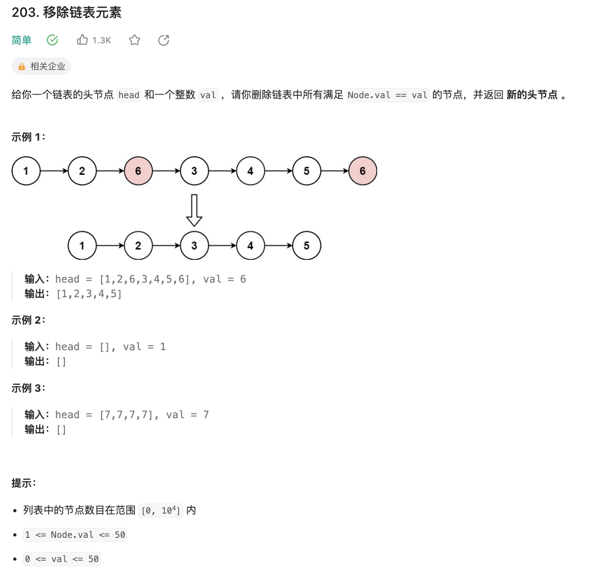

# 203.移除链表元素

[力扣题目链接](https://leetcode.cn/problems/remove-linked-list-elements/description/)



```cpp
// Definition for singly-linked list.
// struct ListNode {
//     int val;
//     ListNode *next;
//     ListNode() : val(0), next(nullptr) {}
//     ListNode(int x) : val(x), next(nullptr) {}
//     ListNode(int x, ListNode *next) : val(x), next(next) {}
// };

class Solution {
public:
    ListNode* removeElements(ListNode* head, int val) {
        ListNode* dummyhead = new ListNode(0, head);
        ListNode* current= dummyhead;
        while(current->next!= NULL){
            if (current->next->val == val){
                ListNode* tmp = current->next;
                current->next=current->next->next;
                delete tmp; // 问题tmp不是new创建的为什么能用delete
            } else current = current->next;
        }
        head = dummyhead->next;
        delete dummyhead;
        return head;
    }
};
```