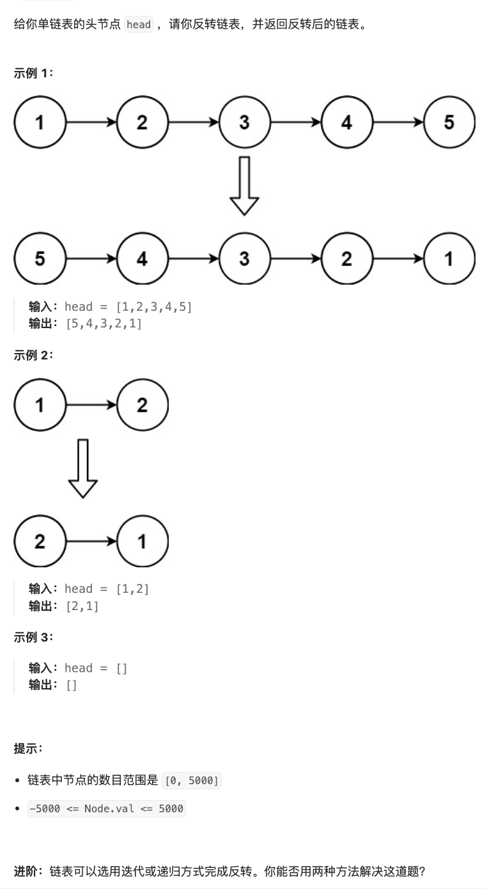

# 206.反转链表

[力扣题目链接](https://leetcode.cn/problems/reverse-linked-list/description/)




#### 双指针迭代法
```cpp
// Definition for singly-linked list.
// struct ListNode {
//     int val;
//     ListNode *next;
//     ListNode() : val(0), next(nullptr) {}
//     ListNode(int x) : val(x), next(nullptr) {}
//     ListNode(int x, ListNode *next) : val(x), next(next) {}
// };
class Solution {
public:
    ListNode* reverseList(ListNode* head) {
        ListNode* current = head;
        ListNode* pre = nullptr;
        while (current){
          // 指针换向
          ListNode* tmp = current->next;
          current->next = pre;
          // 后移
          pre = current;
          current = tmp;
        }
        return pre;
    }
};
```

#### 递归法
```cpp
class Solution {
public:
    ListNode* reverse(ListNode* current, ListNode* pre){
        if (!current) return pre;
        ListNode*tmp = current->next;
        current->next = pre;
        return reverse(tmp, current);
    }

    ListNode* reverseList(ListNode* head) {
        return reverse(head, nullptr);
    }
};
```