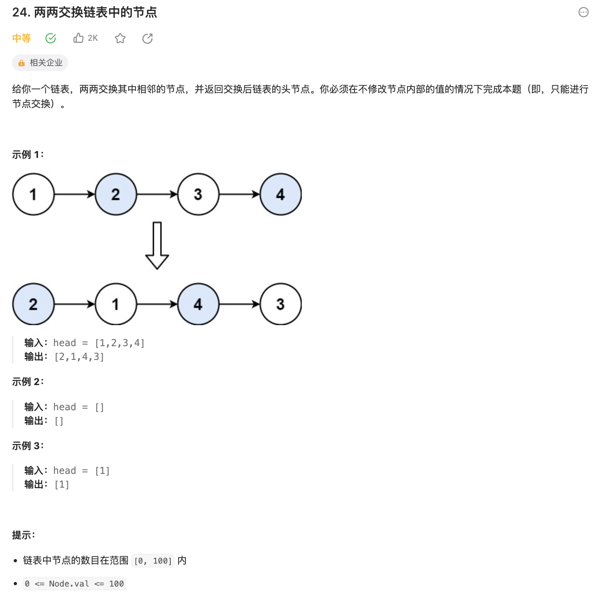

# 24.两两交换链表中的节点

[力扣题目链接](https://leetcode.cn/problems/swap-nodes-in-pairs/description/)



##### 思路


```cpp
// Definition for singly-linked list.
// struct ListNode {
//     int val;
//     ListNode *next;
//     ListNode() : val(0), next(nullptr) {}
//     ListNode(int x) : val(x), next(nullptr) {}
//     ListNode(int x, ListNode *next) : val(x), next(next) {}
// };

class Solution {
public:
    ListNode* swapPairs(ListNode* head) {
        ListNode* dummyhead = new ListNode(0);
        dummyhead->next = head;
        ListNode* current = dummyhead;
        while(current->next && current->next->next){
            ListNode* tmp1 = current->next;
            ListNode* tmp2 = current->next->next->next;
            // 指针换向
            current->next = current->next->next;
            current->next->next = tmp1;
            tmp1->next = tmp2;
            // 后移
            current = current->next->next; // tmp1和current->next->next可相互替换
        }
        return dummyhead->next;// 此处dummyhead->next不等于head
    }
};
```