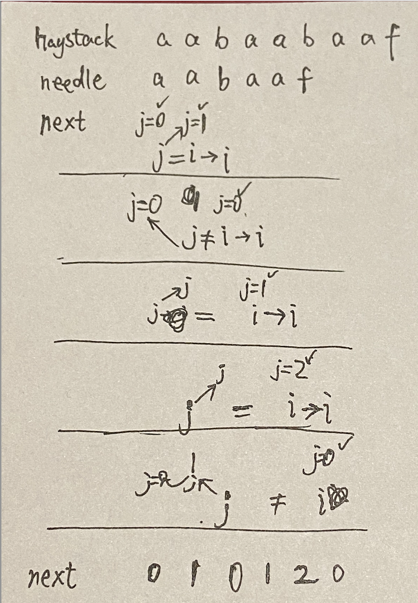

# 28.实现strStr() - KMP

[力扣链接](https://leetcode.cn/problems/find-the-index-of-the-first-occurrence-in-a-string/description/)

**前缀表是用来回退的，它记录了模式串与主串(文本串)不匹配的时候，模式串应该从哪里开始重新匹配。**




```cpp
class Solution {
public:
    // 前缀表（next数组）显示每个子字符串最长相等前后缀的长度
    void getNext(int* next, const std::string& s) {
        // i后缀末尾，j前缀末尾/包括i之前的子串的最长相等前后缀的长度
        // 第一步 初始化
        next[0] = 0;
        int i=1, j=0;
        for(; i < s.size(); i++) {
            // 第二步 前后缀不相同 前缀j要向前回退 跳到前缀表中前一位下标对应的索引处
            // 用while不用if 因为遇见冲突要连续回退
            while (j > 0 && s[i] != s[j]) j = next[j - 1];
            // 第三步 前后缀相同
            if (s[i] == s[j]) j++; //包括i之前的子串的最长相等前后缀的长度是1，j=0+1=1
            // 第四步 更新next
            next[i] = j;// next[1]=j=1 用j更新next下一位
        }
    }
    int strStr(std::string haystack, std::string needle) {
        if (needle.size()==0) return 0;
        // next 类型是int*，此处数组名用作指针，如int arr[] = {1,2,3};
        int next[needle.size()];
        getNext(next, needle);
        int i=0, j=0; // i是haystack指针，j是needle指针
        for (;i<haystack.size();i++){
            while(j>0 && haystack[i]!=needle[j]) j = next[j-1];
            if (haystack[i] == needle[j]) j++;
            if (j== needle.size()) return i-needle.size()+1;
        }
        return -1;
    }
};
```