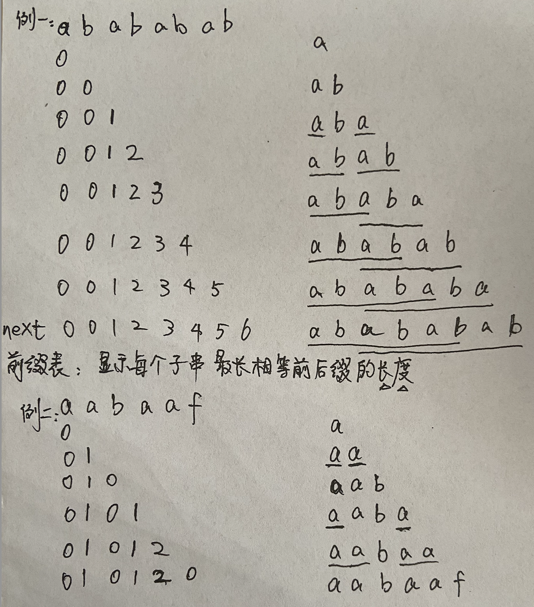

# 459.重复的子字符串

[力扣链接](https://leetcode.cn/problems/repeated-substring-pattern/description/)




```cpp
class Solution {
public:
    // 前缀表（next数组）显示每个子字符串最长相等前后缀的长度
    void getNext(int* next, const std::string& s) {
        // i后缀末尾，j前缀末尾/包括i之前的子串的最长相等前后缀的长度
        // 第一步 初始化
        next[0] = 0;
        int i=1, j=0;
        for(; i < s.size(); i++) {
            // 第二步 前后缀不相同 前缀j要向前回退 跳到前缀表中前一位下标对应的索引处
            // 用while不用if 因为遇见冲突要连续回退
            while (j > 0 && s[i] != s[j]) j = next[j - 1];
            // 第三步 前后缀相同
            if (s[i] == s[j]) j++; //包括i之前的子串的最长相等前后缀的长度是1，j=0+1=1
            // 第四步 更新next
            next[i] = j;// next[1]=j=1 用j更新next下一位
        }
    }
    bool repeatedSubstringPattern (string s) {
        int len = s.size();
        // if (len == 0) return false; 非空字符串
        int next[len];
        getNext(next, s);
        // 原字符串s的最长相等前后缀是next[len - 1]
        if (next[len - 1] != 0 && len % (len - (next[len - 1])) == 0) return true;
        return false;
    }
};
```

* 字符串如果由重复子串组成，最小重复单位是整个字符串中最长相等前后缀不包含的子串 $len - (next[len - 1])$
* 原字符串如果能整除 整个字符串中最长相等前后缀不包含的子串的长度 $len - (next[len - 1])$ 说明字符串由重复的子串组成