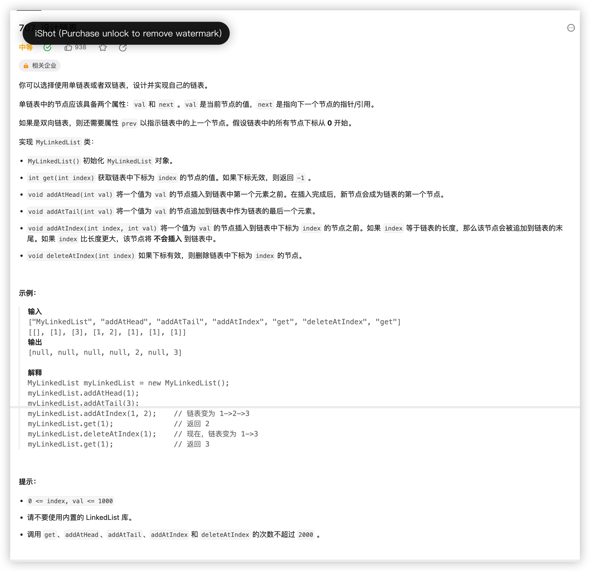

# 707. 设计链表

[力扣题目链接](https://leetcode.cn/problems/design-linked-list/description/)



```cpp
class MyLinkedList{
public:
    // struct ListNode{
    //     int val;
    //     ListNode* next;
    //     ListNode(int x):val(x), next(NULL){}
    // };

    MyLinkedList(){
        dummyhead = new ListNode(0);
        size = 0;
    }

    int get(int index){
        if (index > size-1 || index < 0) return -1;
        ListNode* current = dummyhead->next;
        while(index--) current = current->next;
        return current->val;
    }
    void addAtHead(int val){
        ListNode* newnode = new ListNode(val);
        newnode->next = dummyhead->next;
        dummyhead->next = newnode;
        size++;
    }
    void addAtTail(int val){
        ListNode* current = dummyhead, *newnode = new ListNode(val);
        while (current->next!=NULL) current = current->next;
        current->next = newnode;
        size++;
    }
    void addAtIndex(int index, int val){
        if (index >= 0 && index <= size){
            ListNode* current = dummyhead, *newnode = new ListNode(val);
            while (index--) current = current->next;
            newnode->next = current->next;
            current->next = newnode;
            size++;
        }
        else if (index > size) return;
        else index = 0;
    }

    void deleteAtIndex(int index){
        if (index < 0 || index > size-1) return;
        ListNode *current = dummyhead;
        while (index--) current = current->next;
        // 标记一下 current->next 之后才能删除内存
        ListNode *tmp = current->next;
        current->next = current->next->next;
        //delete命令指示释放了tmp指针原本所指的那部分内存，
        //被delete后的指针tmp的值（地址）并非就是NULL，而是随机值。也就是被delete后，
        //如果不再加上一句tmp=nullptr,tmp会成为乱指的野指针
        //如果之后的程序不小心使用了tmp，会指向难以预想的内存空间
        delete tmp;
        tmp = nullptr;
        size--;
    }

    void printLinkedList(){
        ListNode*current = dummyhead->next;
        while (current != NULL){
            std::cout << current->val << " ";
            current = current->next;
        }
    }

private:
    ListNode* dummyhead;
    int size;
};

```