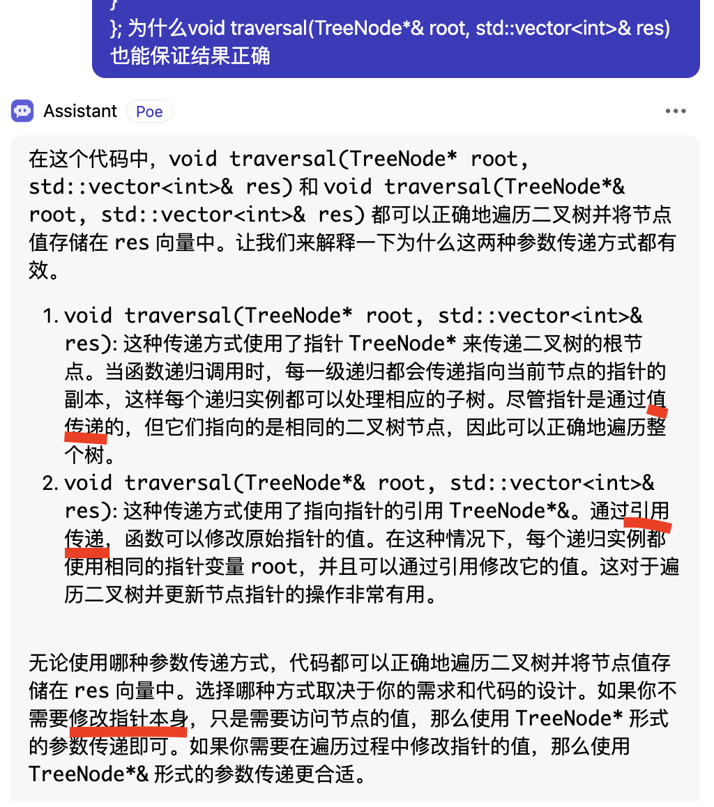

## 深度优先搜索：

* 前序遍历（递归、迭代）
* 中序遍历（递归、迭代）
* 后序遍历（递归、迭代）

#### 前序
[144.二叉树的前序遍历](https://leetcode.cn/problems/binary-tree-preorder-traversal/description/)

```cpp
// 前序递归
/**
 * Definition for a binary tree node.
 * struct TreeNode {
 *     int val;
 *     TreeNode *left;
 *     TreeNode *right;
 *     TreeNode() : val(0), left(nullptr), right(nullptr) {}
 *     TreeNode(int x) : val(x), left(nullptr), right(nullptr) {}
 *     TreeNode(int x, TreeNode *left, TreeNode *right) : val(x), left(left), right(right) {}
 * };
 */

class Solution {
public:
    // 错误 std::vector<int> res
    // 若修改指针，引用传递；若仅访问值不修改指针，值（副本）传递 *
    void traversal(TreeNode* root, std::vector<int>&res){
        if (!root)return; // if (root==nullptr)return; 
        res.push_back(root->val);
        traversal(root->left, res);
        traversal(root->right, res);
    }
    std::vector<int> preorderTraversal(TreeNode* root) {
        std::vector<int> res;
        traversal(root, res);
        return res;
    }
};
```
##### ？迭代法中如果用queue代替stack，需要做什么变化
```cpp
// 前序迭代
class Solution {
public:
    std::vector<int> preorderTraversal(TreeNode* root) {
        std::vector<int> res; // 未初始化的容器可能不为空 *
        if (!root) return {};// 也可 return res;
        std::stack<TreeNode*> st;
        st.push(root);
        while(!st.empty()){
            TreeNode* node = st.top();
            st.pop();
            // 位置不一定要在if从句前，只修改res 和入栈无关
            res.push_back(node->val);
            // 先右后左入栈 中 左 右
            if(node->right) st.push(node->right);
            if(node->left) st.push(node->left);
        }
        return res;
    }
};
```

#### 中序
[94.二叉树的中序遍历](https://leetcode.cn/problems/binary-tree-inorder-traversal/description/)

```cpp
// 中序递归
class Solution {
public:
    std::vector<int> inorderTraversal(TreeNode* root) {
        std::vector<int> res;
        traversal(root, res);
        return res;
    }

    void traversal(TreeNode*root, std::vector<int>&res){
        if (!root) return;
        traversal(root->left, res);
        res.push_back(root->val);
        traversal(root->right, res);
    }
};
```

```cpp
// 中序迭代
class Solution {
public:
    std::vector<int> inorderTraversal(TreeNode* root) {
        std::vector<int> res;
        std::stack<TreeNode*> st;
        TreeNode* current = root;
        while(current|| !st.empty()){// while(current!=nullptr||!st.empty())
            // current不为空就一直往左走到底
            if(current){ //  if(current!=nullptr)
                st.push(current);
                current = current->left;
            } else {
                // 在左边走到底后 current回到存在栈顶的上个节点-中，然后向右走
                current = st.top();
                st.pop();
                res.push_back(current->val);
                current = current->right;
            }
        }
        return res;
    }  
};
```

#### 后序
[145.二叉树的后序遍历](https://leetcode.cn/problems/binary-tree-postorder-traversal/description/)

```cpp
// 后序递归
class Solution {
public:
    void traversal(TreeNode* root, std::vector<int>&res){
        if (!root) return;
        traversal(root->left, res);
        traversal(root->right, res);
        res.push_back(root->val);
    }
    std::vector<int> postorderTraversal(TreeNode* root) {
        std::vector<int> res;
        traversal(root, res);
        return res;
    }
};
```

```cpp
// 后续迭代
class Solution {
public:
    vector<int> postorderTraversal(TreeNode* root) {
        std::vector<int> res;
        std::stack<TreeNode*> st;
        if (!root) return res;
        // 错误 忘记st.push(root);
        st.push(root);
        while(!st.empty()){
            TreeNode* node = st.top();
            st.pop();
            res.push_back(node->val);
            // 先左后右入栈 中 右 左，反转 左 右 中
            if(node->left) st.push(node->left);
            if(node->right) st.push(node->right); 
        }
        std::reverse(res.begin(), res.end());
        return res;
    }
};

```
## 广度优先搜索
### 层序遍历（迭代（栈）遍历）

[102.二叉树的层序遍历](https://leetcode.cn/problems/binary-tree-level-order-traversal/description/)

```cpp
class Solution {
public:
    std::vector<std::vector<int>> levelOrder(TreeNode* root) {
        std::vector<std::vector<int>> res;
        std::queue<TreeNode*> que;
        // std::queue 是容器适配器（基于其他容器实现了队列的功能）可通过
        // que.push(nullptr) 将一个空指针添加到队列中
        if (root)  que.push(root);
        while(!que.empty()){
            int size = que.size();
            std::vector<int> vec;
            while(size--){
                TreeNode* node = que.front(); que.pop();
                vec.push_back(node->val);
                if (node->left) que.push(node->left);
                if (node->right) que.push(node->right);
            }
            res.push_back(vec);
        }
        return res;   
    }
};
```


## 注释
* 二叉树的前序遍历递归法: 
**若修改指针，引用传递；若仅访问指针的值不修改指针，值（副本）传递**



* 未初始化的容器在创建容器对象时，没有显式地调用构造函数进行初始化。未初始化的容器的状态是未定义的，可能包含任意的值，而不一定自动成为空容器。因此，访问未初始化的容器的元素或执行其他操作可能会导致未定义行为。
```std::vector<int> myVector;  // 未初始化的容器，可能不为空```

    * 为了确保容器为空，应显式地调用容器的构造函数或使用初始化列表进行初始化：
```std::vector<int> myVector{};  // 构造函数构造空容器```
```std::vector<int> myVector = std::vector<int>();  // 初始化列表构造空容器```
